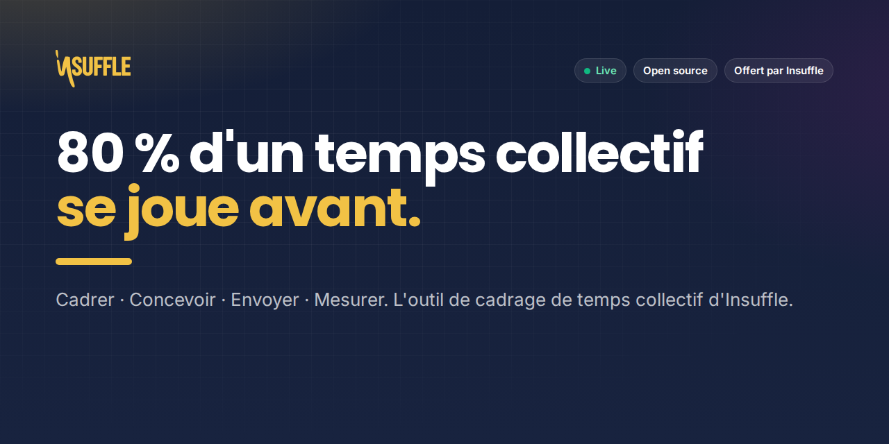
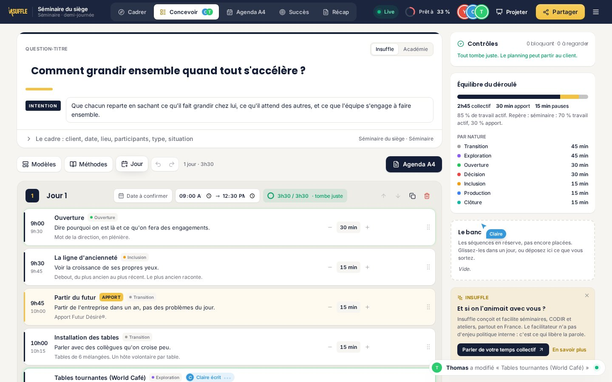
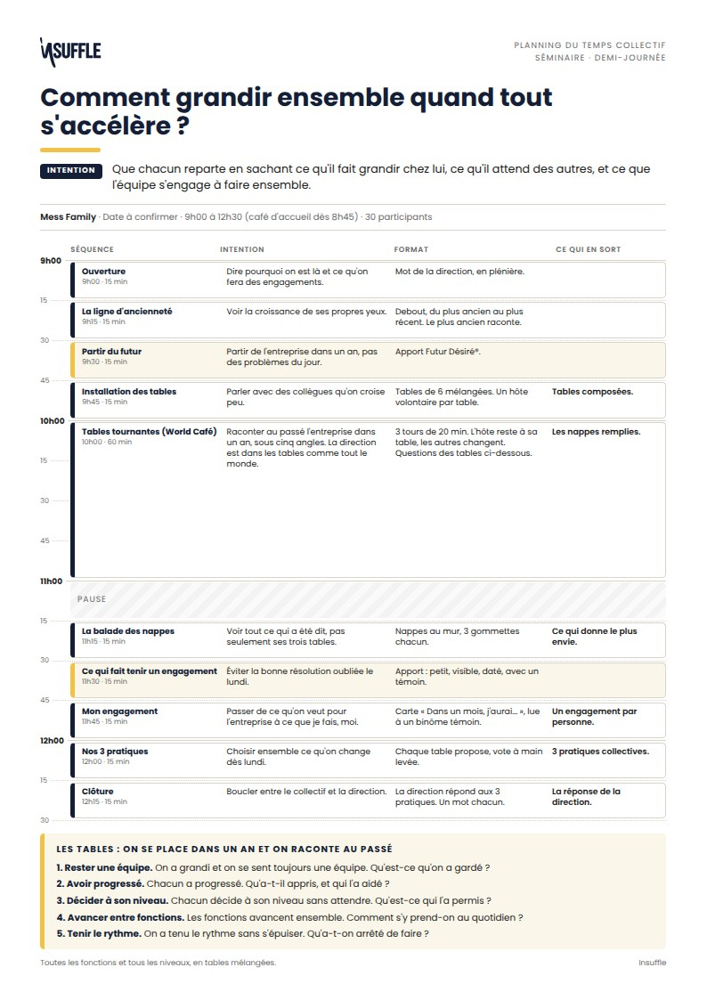
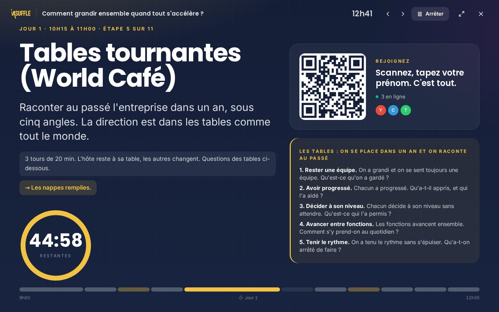
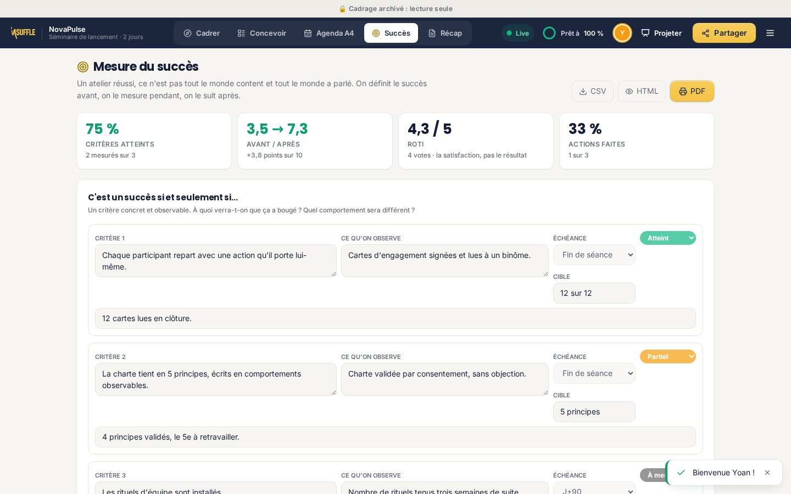
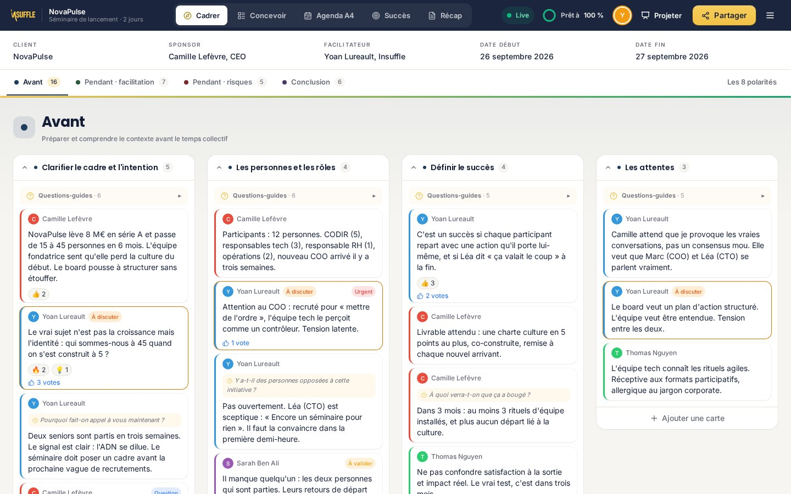
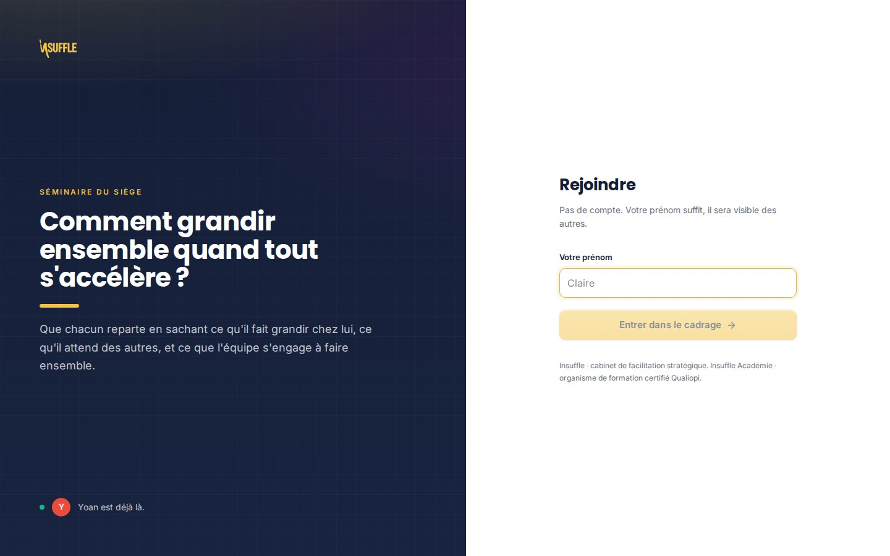
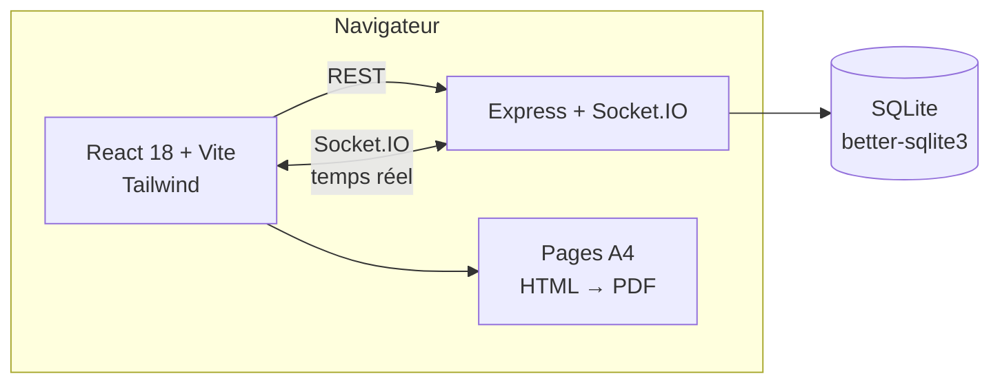
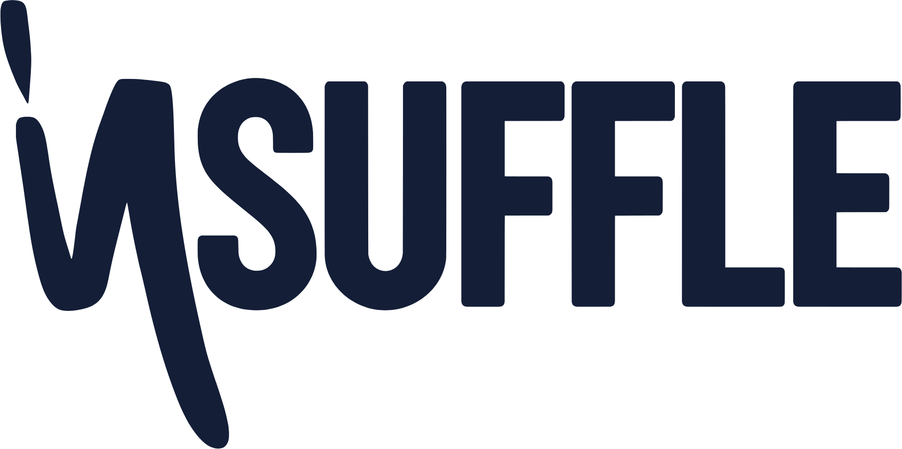

<div align="center">

<a href="https://cadrage.insuffle.com"></a>

<h3>Cadrer · Concevoir · Envoyer · Mesurer</h3>

<p>L'outil de cadrage de temps collectif d'<a href="https://insuffle.com">Insuffle</a> et d'<a href="https://insuffle-academie.com">Insuffle Académie</a>.<br>
Offert, open source, en direct à plusieurs.</p>

<p>
<a href="https://cadrage.insuffle.com"></a>
<a href="https://cadrage.insuffle.com/6AG_demo"></a>
</p>

<p>
<a href="LICENSE"></a>
<a href="CONTRIBUTING.md"></a>


</p>

<p>
<a href="#pourquoi">Pourquoi</a> ·
<a href="#ce-que-fait-loutil">Ce que fait l'outil</a> ·
<a href="#démarrer">Démarrer</a> ·
<a href="#architecture">Architecture</a> ·
<a href="#contribuer">Contribuer</a> ·
<a href="#linsuffle-autour">Insuffle</a>
</p>

</div>

---

## Pourquoi

Un séminaire raté, c'est rarement un problème d'animation. C'est un problème de cadrage.

On arrive dans la salle sans question claire. Le sponsor attend une chose, le groupe en vit une autre. Le déroulé tient sur un coin de mail. Et le lendemain, personne ne sait dire si ça a marché.

Cet outil, c'est la méthode de cadrage qu'Insuffle utilise sur le terrain, mise dans un espace partagé. Il fait quatre choses, dans l'ordre :

| | | |
|---|---|---|
| **1. Cadrer** | avec le sponsor, avant tout | Les quatre temps du cadrage, les questions génératives, les 8 polarités pour régler la posture. On voit les écarts avant d'entrer dans la salle. |
| **2. Concevoir** | le déroulé au quart d'heure | Une question-titre, une intention, des séquences qui tombent juste. 43 méthodes, le double diamant, des contrôles qui repèrent le trou, le débordement, les 2 h sans pause. |
| **3. Envoyer** | une page A4 par jour | Le planning client lisible en une minute, la fiche animateur pour soi. PDF, HTML modifiable, JSON. Toujours aux couleurs Insuffle. |
| **4. Mesurer** | le succès, pas l'ambiance | Des critères observables posés avant. Avant 1, après 10, voté en direct par la salle. Le ROTI à part. La suite à 72 h, J+15, J+90. |

> *« La facilitation, c'est rendre le système intelligent en le questionnant. »*

## Ce que fait l'outil

<table>
<tr>
<td width="50%"><br><sub><b>Concevoir, en direct.</b> Les curseurs de chacun, « Claire écrit » sur la séquence qu'elle modifie, ce qui vient de bouger s'illumine de la couleur de son auteur.</sub></td>
<td width="50%"><br><sub><b>Le planning A4.</b> Question-titre, intention, grille au quart d'heure, encadré des sous-questions. Le format validé d'Insuffle, au millimètre.</sub></td>
</tr>
<tr>
<td><br><sub><b>Le mode salle.</b> Projeté le jour J : l'étape en cours, un grand compte à rebours, le QR code pour rejoindre, le vote qui se remplit. Les téléphones suivent.</sub></td>
<td><br><sub><b>Mesurer le succès.</b> Critères observables, échelle Avant / Après, ROTI, la suite : qui fait quoi, pour quand.</sub></td>
</tr>
<tr>
<td><br><sub><b>Cadrer avec le sponsor.</b> Les questions-guides de la méthode, des cartes, des votes, les 8 polarités.</sub></td>
<td><br><sub><b>Rejoindre en un prénom.</b> Pas de compte. On voit la question et qui est déjà là.</sub></td>
</tr>
</table>

<details>
<summary><b>Tout le détail, fonction par fonction</b></summary>

#### Cadrer
- Quatre temps : Avant, Pendant (facilitation), Pendant (risques), Conclusion, avec leurs questions-guides
- Cartes, commentaires, réactions, votes, mode silencieux, projecteur
- Les 8 polarités : chacun se positionne, les divergences sautent aux yeux
- Repères Insuffle : Boussole 4C, le cadre et le cadre de facilitation, les 3P, la carte de la complexité du collectif, les trois facilitations, 28 questions génératives, décider sans arbitrer

#### Concevoir
- Fiche du temps collectif : question-titre, intention, client, lieu, participants, situation du collectif
- Jours et séquences (collectif, apport, pause), horaires calculés, glisser-déposer, banc des séquences en réserve
- Ce qui part au client (intention, format, ce qui en sort) séparé des coulisses (consignes, matériel, rôles, points d'attention)
- Bibliothèque de 43 méthodes (1-2-4-Tous, World Café, forum ouvert, TRIZ, pré-mortem, troïka, décision par consentement…), filtrable « compatible visio »
- Méthodes suggérées par le cadrage : les 8 polarités et la situation du collectif proposent les méthodes adaptées, avec leur raison
- Échanges sur chaque séquence, en direct
- 7 modèles Insuffle qui tombent juste au quart d'heure (séminaire demi-journée, CODIR 2 jours, lancement de projet, décision, rétro, formation Académie, visio)
- Contrôles : question-titre, dépassement, trous, grille de 15 min, tirets longs, 2 h sans pause, équilibre actif / apport, double diamant
- Annuler / rétablir, mode Jour J

#### Envoyer
- Planning client A4 (portrait ou paysage matin / après-midi), charte Insuffle ou Académie
- Fiche animateur, fiche de mesure du succès, PDF du cadrage complet
- PDF, HTML modifiable, JSON au format de la compétence `planning-temps-collectif` (aller-retour), CSV, texte pour un mail

#### Mesurer
- Critères « c'est un succès si et seulement si… » avec observable, échéance, cible, statut
- Échelle Avant / Après et ROTI votés en direct, depuis les téléphones
- La suite : actions, responsables, échéances, retards ; rendez-vous J+15 et J+90
- La grille d'observation du facilitateur

#### Le direct
- Présence : qui est là, sur quel onglet, sur quelle séquence
- Curseurs partagés, « X écrit », illumination des modifications, fil d'activité
- Mode salle projeté, étape suivie par les téléphones, QR code
- Jauge « Prêt à X % » : les 9 points d'un temps collectif prêt ; premiers pas sur un cadrage vide

</details>

## Démarrer

Il vous faut [Node.js](https://nodejs.org) 20 ou plus.

```bash
git clone https://github.com/ylureault/cadrage.git
cd cadrage
npm run install:all   # installe la racine, le serveur et le client
npm run dev           # serveur sur :3001, client sur :3000
```

Ouvrez [http://localhost:3000](http://localhost:3000) et cliquez sur **Essayer un cadrage complet** : vous obtenez votre propre copie de la démo NovaPulse, modifiable, datée d'aujourd'hui, où chaque fonction est remplie. La démo de référence, en lecture seule, est à [/6AG_demo](http://localhost:3000/6AG_demo).

| Commande | Ce qu'elle fait |
|---|---|
| `npm run dev` | Serveur et client en développement, rechargement à chaud |
| `npm test` | Tous les tests (serveur et client) |
| `npm run build` | Construit le client dans `client/dist` |
| `npm start` | Lance le serveur, qui sert aussi le client construit |

### En production

```bash
npm run install:all
npm run build
PORT=3001 npm start
```

Le serveur Express sert l'API, le temps réel (Socket.IO) et le client construit. **Après chaque mise à jour : reconstruire l'interface ET redémarrer le serveur** (voir [DEPLOIEMENT.md](DEPLOIEMENT.md)). Les données vivent dans `server/data/cadrage.db` (SQLite). Les migrations se font seules au démarrage : pensez à sauvegarder ce fichier avant une mise à jour.

## Architecture



```
cadrage/
├── client/                 Interface React
│   └── src/
│       ├── components/     Écrans (cadrer, planning, succès, salle, shell…)
│       ├── planning/       Cœur métier : calculs, contrôles, méthodes, modèles, pages A4, exports
│       └── live/           Présence, curseurs, fil d'activité
├── server/                 API et temps réel
│   └── src/
│       ├── app.js          Routes REST et événements Socket.IO
│       ├── planning.js     Jours et séquences
│       ├── success.js      Mesure du succès
│       ├── templates.js    Modèles Insuffle
│       └── db.js           Schéma SQLite et migrations
├── features/               Spécifications Gherkin
└── docs/                   User stories, cas de test, visuels
```

Les horaires ne sont jamais stockés : ils se déduisent de l'ordre et des durées. Chaque modification du planning renvoie son état complet à toute la salle, ce qui évite toute dérive entre participants.

## Contribuer

Ce projet est ouvert. Facilitateurs, formateurs, développeurs, designers : vous êtes les bienvenus.

- **Vous facilitez ?** Proposez une méthode pour la bibliothèque, un modèle de déroulé, une question générative. [Ouvrir une proposition](https://github.com/ylureault/cadrage/issues/new?template=methode.yml)
- **Vous avez trouvé un bug ?** [Le signaler](https://github.com/ylureault/cadrage/issues/new?template=bug.yml)
- **Vous codez ?** Lisez le [guide de contribution](CONTRIBUTING.md), prenez une issue marquée `bon premier sujet`, ouvrez une pull request.

Merci de respecter le [code de conduite](CODE_OF_CONDUCT.md). Pour une faille de sécurité, suivez la [politique de sécurité](SECURITY.md).

## L'Insuffle autour

Cet outil est offert par Insuffle. Le terrain, c'est notre métier.

| | |
|---|---|
| 🧭 **[insuffle.com](https://insuffle.com)** | Cabinet de facilitation stratégique : séminaires CODIR, séminaires sur-mesure, facilitation ponctuelle, accompagnement de transformation |
| 🎓 **[insuffle-academie.com](https://insuffle-academie.com)** | Organisme de formation certifié Qualiopi : facilitation et intelligence collective, manager facilitateur, sketchnoting, bootcamp |
| ✨ **[futur-desire.com](https://futur-desire.com)** | La méthode Futur Désiré® : Observer, Désirer, Concevoir, Transformer |
| 🧑‍🏫 **[formation-facilitation.com](https://formation-facilitation.com)** | La formation Facilitation & Intelligence Collective |
| 🧑‍💼 **[manager-facilitateur.com](https://manager-facilitateur.com)** | La formation Manager Facilitateur |
| 🏛️ **[formation-codir.com](https://formation-codir.com)** | Diriger ensemble dans la complexité |
| 🧮 **[boussole.insuffle.com](https://boussole.insuffle.com)** | La Boussole 4C : cap, contraintes, capacités, cadence |
| ⏱️ **[timer.insuffle.com](https://timer.insuffle.com)** | Un timer projetable pour vos ateliers |
| ⚡ **[flash-codir.insuffle.com](https://flash-codir.insuffle.com)** | L'autodiagnostic rapide d'un comité de direction |

Un temps collectif à préparer ? **30 minutes d'échange, gratuit et sans engagement** : [contact@insuffle.com](mailto:contact@insuffle.com) · 09 80 80 89 62.

## Licence

Le code est sous [licence MIT](LICENSE). Le nom, le logo et la charte d'Insuffle et d'Insuffle Académie, la marque Futur Désiré®, ainsi que les contenus de méthode (modèles, bibliothèque, repères) restent la propriété d'Insuffle : voir [MARQUES.md](MARQUES.md).

<div align="center">
<br>
<a href="https://insuffle.com"></a>
<br><br>
<sub>Fait à Deauville, avec les facilitateurs qui s'en servent.</sub>
</div>
